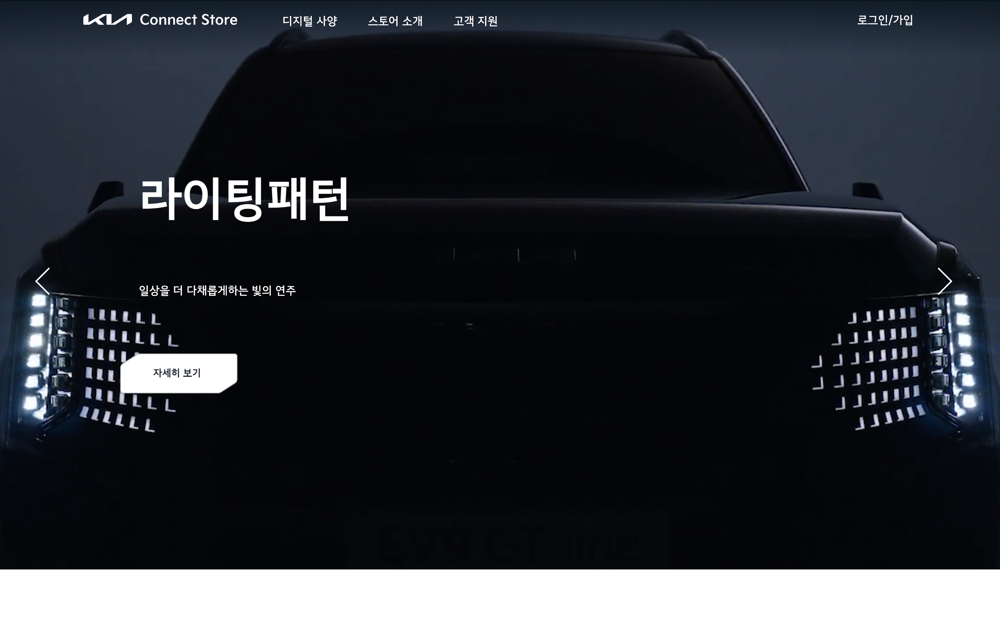
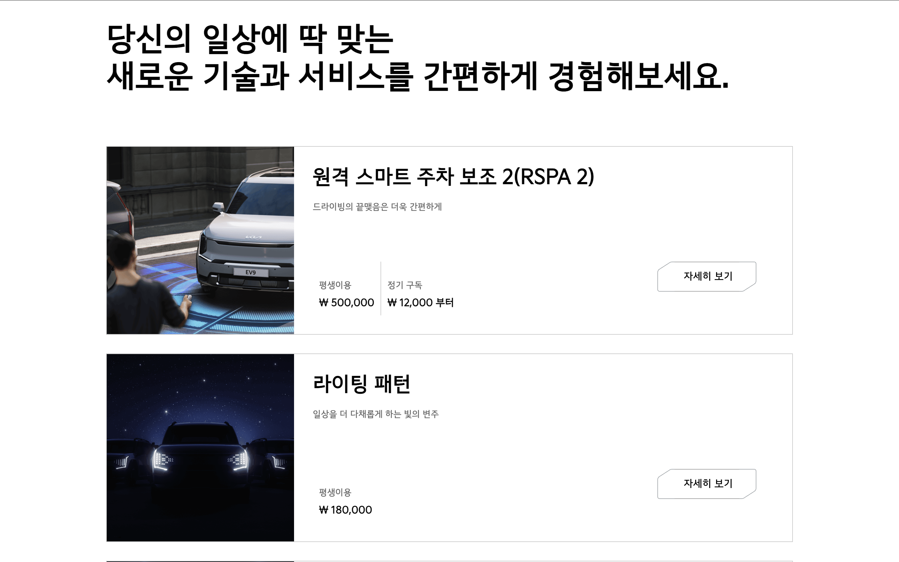
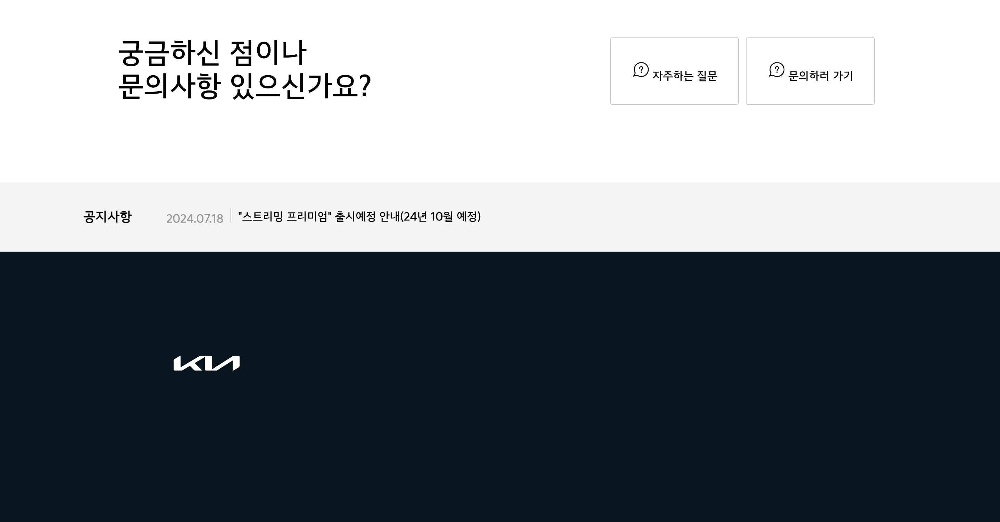

# KIA 클론코딩 🚘

[원본 사이트 바로가기](https://connectstore.kia.com/kr/main)

[클론 사이트 바로가기](https://myeong-jae-hwi.github.io/iot/kia/index)

### 메인 화면

메인화면은 동영상의 크기가 화면을 꽉 차게 만들었습니다. 또한 ul 과 li를 사용하여 화면 전환도 가능하게 만들었습니다.

내부 텍스트와 버튼은 position을 absolute를 주어 동영상 위에 위치할 수 있게 했습니다.

### 리스트

리스트는 div로 묶어 컴포넌트 단위로 관리했습니다. 각각의 요소에 이미지 경로만 다르게 설정해 재사용이 용이하게 만들었습니다.

### 푸터

공지사항이 일정 시간동안 바꾸려고 했으나 js를 사용하지 않고 구현이 어려울 것 같아서 보류했습니다.
