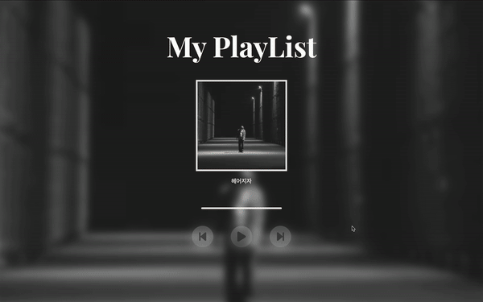

# 플레이리스트 🎧

[바로가기](http://127.0.0.1:5501/my_playlist/index.html)

### 코드설명

#### 음원

```js
const MUSIC_ARR = ["dori", "pateco", "QWER", "HAPPY"];
const TITLE = ["헤어지자", "너를 떠올리는 중이야", "내이름 맑음", "HAPPY"];
```

음원 정보 배열입니다. 이 부분은 객체로 만드는게 편했겠지만 처음에는 타이틀을 안넣을 생각으로 MUSIC_ARR 만 만들고 나중에 추가한거라.. 사실 코드 고치기 귀찮았습니다 🥲

#### 음원의 인덱스를 로드하는 함수

```js
// 현재 인덱스 실행
function musicStart(idx) {
  const audioSrc = `./assets/music/${MUSIC_ARR[idx]}.mp3`;

  // 캐싱 확인
  const cachedAudio = localStorage.getItem(audioSrc);
  if (cachedAudio) {
    audio.src = cachedAudio;
  } else {
    audio.src = audioSrc;
    // 캐싱
    localStorage.setItem(audioSrc, audioSrc);
  }

  audio.load();
}
```

음원이 있는 배열에서 해당 인덱스를 뽑아 로드하는 역할을 합니다. 처음에는 캐싱을 하지 않았는데 성능상의 이슈가 생겨 추가했습니다.

#### 음원 실행함수

```js
function playMusic() {
  spectrum();
  mainBtn.classList.add("play");
  audio.play();
  mainBtn.style.backgroundImage = "url(./assets/images/svg/pause.svg)";
  mainBtn.style.backgroundRepeat = "no-repeat";
  mainBtn.style.backgroundSize = "contain";
  mainBtn.style.backgroundPosition = "center center";
  console.log("play");
  isPlay = true;
}
```

진짜 오디오를 실행하는 함수입니다. 위에서 정한 인덱스의 오디오를 실행합니다.

#### 스펙트럼

웹 api중 AudioContext는 음원의 데이터를 값으로 리턴해줍니다. 이 기능을 이용하여 해당 값을 바의 높이로 설정했습니다. 코드는 너무 길어 첨부하기가 어렵습니다 ㅠ

### 결과화면


