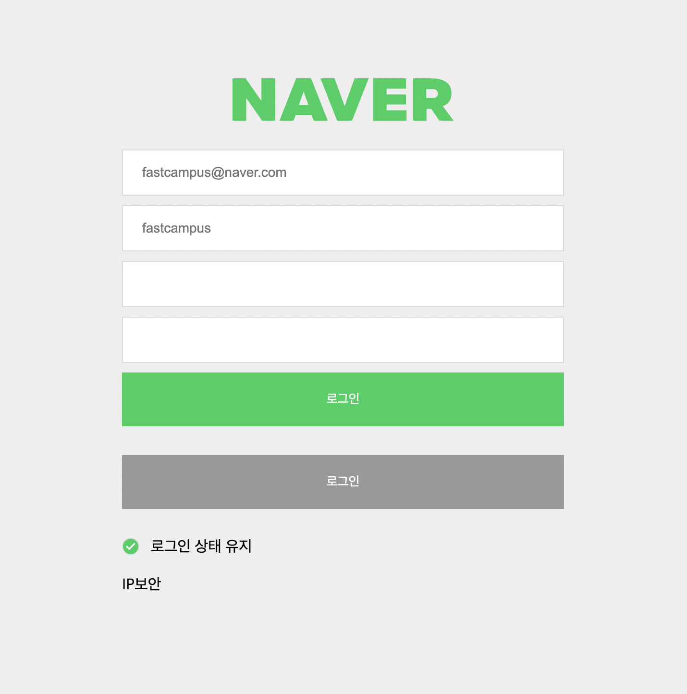

네이버 폼 클론입니다.

소스코드

```html
<header class="header"></header>

<form action="/" class="login-form">
  <input type="email" required / placeholder="fastcampus@naver.com">
  <input type="email" class="id" placeholder="fastcampus" />
  <input type="password" class="pw" />
  <input type="password" class="pw-check" />

  <button class="submit-btn is_active">로그인</button>
  <button class="submit-btn is_deactivate">로그인</button>

  <input id="check" type="checkbox" />
  <label for="check">로그인 상태 유지</label>

  <article class="article">
    <label for="security">IP보안</label>
    <input id="security" type="checkbox" />
  </article>
</form>
```

```css
* {
  margin: 0;
  padding: 0;
  box-sizing: border-box;
}

:root {
  --primary-color: #03cf5d;
  --gray-color: #999999;
  --white-color: #ffffff;
  --back-ground-color: #eee;
  --gray-color-10: #dadada;
}

body {
  display: flex;
  justify-content: center;
  align-items: center;
  flex-direction: column;
  background-color: var(--back-ground-color);
  height: 100vh;
}

.logo {
  display: block;
}

.login-form {
  padding: 20px;
  input {
    display: block;
    width: 28.75rem;
    inline-size: 28.75rem;
    height: 3rem;
    block-size: 3rem;
    background-color: #fff;
    border: solid 1px var(--gray-color-10);
    margin-top: 0.625rem;
    margin-bottom: 10px;
    margin-block: 10px;
    padding: 20px;
    font-size: 0.875rem;
  }

  input[type="checkbox"] {
    display: none;
  }

  input[type="checkbox"] + label {
    display: inline-block;
    position: relative;
    padding-left: 30px;
  }

  input[type="checkbox"] + label::before {
    display: block;
    content: "check";
    font-family: "Material Symbols Outlined";
    color: var(--gray-color-10);
    font-size: 1rem;
    width: 1rem;
    height: 1rem;
    line-height: 1rem;
    border-radius: 50%;
    text-align: center;
    position: absolute;
    left: 0;
    top: 0;
    background-color: #fff;
    border: 1px solid #ddd;
  }

  input[type="checkbox"]:checked + label::before {
    content: "check";
    font-family: "Material Symbols Outlined";
    background-color: var(--primary-color);
    background-size: 1rem;
    color: #fff;
  }
}

.submit-btn {
  width: 460px;
  inline-size: 460px;
  display: block;
  margin-bottom: 30px;
  margin-block-end: 30px;
  height: 56px;
  block-size: 56px;
  border: none;
  color: var(--white-color);
  cursor: pointer;
}

.is_active {
  background-color: var(--primary-color);
}

.is_deactivate {
  background-color: var(--gray-color);
}

.article {
  margin-top: 1.25rem;
  margin-bottom: 1.25rem;
  margin-block: 1.25rem;
}
```

최종 결과

