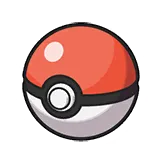
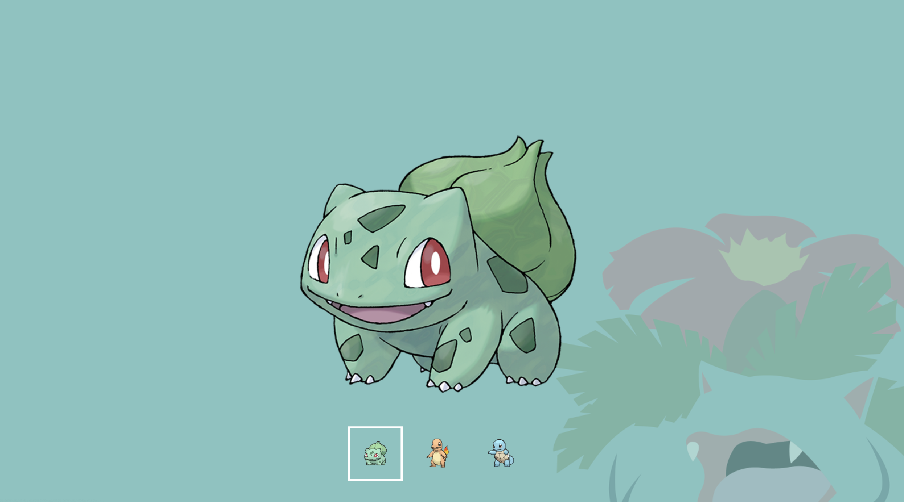
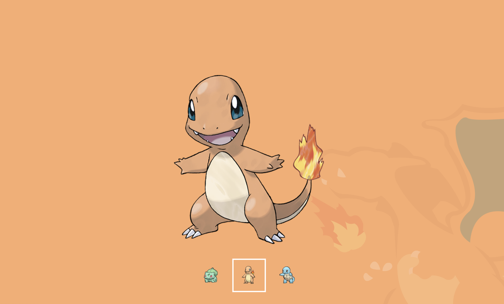
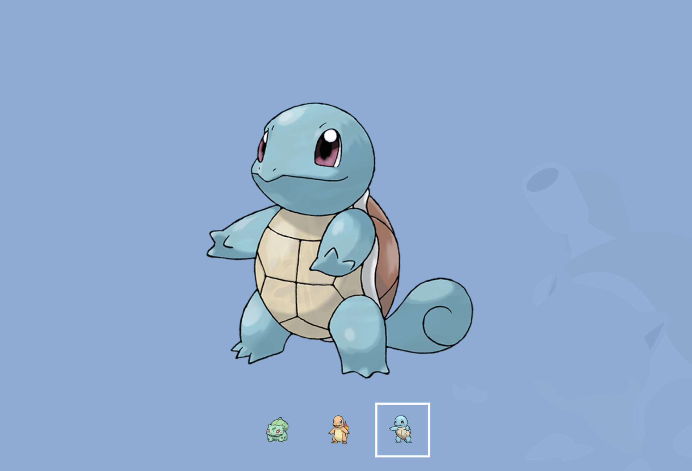

## 포켓몬 페이지 구현

👉 [미리보기](https://myeong-jae-hwi.github.io/js-homework/mission03/client/poketmon/poketmon.html)



### 함수 설명 📝

1번 4번 7번을 url에 붙이는 함수 (스타팅 포켓몬 번호)

```js
function getPoketmon() {
  const url = [];
  for (let i = 1; i <= 7; i += 3) {
    url.push(`${END_POINT}/${i}`);
  }
  console.log(url);
  return url;
}
```

각 버튼에 불러온 이미지 렌더링하는 함수

```js
const url = getPoketmon();
const index = [];

function renderButton() {
  for (let i = 0; i < 3; i++) {
    console.log();

    index.push(url[i]);

    // 버튼 이미지
    getData(url[i]).then((res) => {
      insertLast(button[i], ``);
    });
  }
}
```

울음소리 가져오는 함수

```js
async function getCrise() {
  const crise = [];
  const audioList = [];

  for (let i = 0; i < 3; i++) {
    crise.push(url[i]);

    try {
      const res = await getData(url[i]);
      const cries = res.data.cries;
      const latestCryUrl = cries.latest;

      const audio = new Audio(latestCryUrl);
      audioList.push(audio);
    } catch {
      console.error("오류가 발생했습니다");
      alert("에러가 발생했습니다. 지연이 지속되면 문의 주시기 바랍니다. \n📞 010-0000-0000");
    }
  }

  return audioList;
}
```

이미지 변경함수

```js
function setImage(idx) {
  getData(url[idx - 1]).then((res) => {
    const image = getNode("img");
    image.src = `${res.data.sprites.other["official-artwork"].front_default}`;

    console.log(`../assets/bg${idx}.png`);
    body.style.backgroundColor = data[idx - 1];
    body.style.backgroundImage = "none";
    body.style.setProperty("--bg-image", `url("../assets/bg0${idx}.png")`);
  });
}
```

### 결과화면




